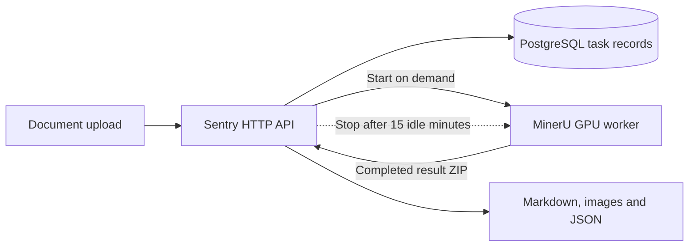

# MinerU-Sentry

English | [简体中文](docs/zh-CN/README-cn.md)

**An on-demand GPU gateway for self-hosted MinerU: accept document parsing jobs over HTTP, keep task records in PostgreSQL, and stop the worker when it is idle.**

[Quick start](#quick-start) · [Parse a document](#parse-a-document) · [Configuration](#configuration) · [MinerU upstream](https://github.com/opendatalab/MinerU)



The gateway has no GPU allocation in Compose. Only the worker runs inference; Sentry starts an **existing container**, waits for its API, and stops it after a configurable idle period.

## Why Sentry

- **Keep the API available between parsing jobs.** The gateway and database stay running while the GPU worker is stopped. Wake and sleep endpoints also allow manual control.
- **Track work beyond the HTTP request.** Submissions return a task ID; task and segment records, filenames, SHA-256 hashes, and errors are stored in PostgreSQL.
- **Choose how to parse each document.** Forward backend, effort, page range, formula, and table options to MinerU. Defaults are `hybrid-engine` and `medium`.
- **Collect results across resumed runs.** An explicit resume creates a new task, copies completed segments, and combines their Markdown, images, and available middle JSON with the new result. See [recovery boundaries](#resume-and-inspect-results).

**Current scope:** one gateway process managing one GPU worker. The supplied worker recipe targets RTX 5090; this repository does not include hardware benchmarks or an end-to-end GPU test suite.

## Quick start

Run commands from the repository root. Full parsing requires Docker Engine with Compose, a Linux NVIDIA GPU host with a compatible driver and NVIDIA Container Toolkit, and locally downloaded MinerU models. The gateway image uses Python 3.12; Compose supplies PostgreSQL 16.

### 1. Prepare local models

```bash
sudo mkdir -p /usr/model/MinerU/pipeline /usr/model/MinerU/vlm /usr/model/MinerU/data
sudo cp -n core/config/mineru.template.json /usr/model/MinerU/mineru.json
```

Download models for your installed MinerU version using its [local-model instructions](https://opendatalab.github.io/MinerU/usage/model_source/). Place pipeline and VLM model files in the directories above, or edit `models-dir` in `/usr/model/MinerU/mineru.json` to match their locations **inside the worker container**. Empty directories and the JSON template are not enough to parse documents.

Both containers mount `/usr/model/MinerU` at the same path. Keep models and configuration readable and the `data` directory writable by the containers.

### 2. Build and create the worker, then start the gateway

The [Compose file](deploy/docker-compose.yml) includes example database credentials, published ports `8080`, `8000`, and `5432`, and a Docker socket mount for Sentry. Use it on a trusted host; configure credentials and network access before exposing it. The API has no built-in authentication, including GPU control endpoints.

```bash
docker compose -f deploy/docker-compose.yml build sentry mineru_worker
docker compose -f deploy/docker-compose.yml create mineru_worker
docker compose -f deploy/docker-compose.yml up -d sentry postgres
curl --fail-with-body http://localhost:8080/health
```

**Do not skip `create mineru_worker`.** Sentry can start and stop the named container, but cannot create it. The worker stays stopped until a parsing request or manual wake. Its status is normally `created` before the first start and `exited` after a stop.

Open [Swagger UI](http://localhost:8080/docs) for the API schema. `/health` reports Docker worker state, not database readiness. `mineru_api_healthy=false` is expected while the worker is stopped; `is_gpu_active` reflects container state rather than measured GPU utilization.

The [worker Dockerfile](deploy/worker.Dockerfile) uses a mirror of `vllm/vllm-openai:v0.21.0` and installs `mineru[core]>=3.4.0`. Dependencies are not fully pinned; validate the resolved MinerU API and GPU runtime on your host. Startup waits up to 300 seconds by default, with no fixed cold-start guarantee.

## Parse a document

Use a local PDF named `document.pdf`. File-format support comes from the installed MinerU worker; Sentry forwards the uploaded file.

**Submit:**

```bash
curl --fail-with-body http://localhost:8080/api/v1/parse \
  -F 'file=@document.pdf' \
  -F 'backend=hybrid-engine' \
  -F 'effort=medium' \
  -F 'auto_resume=false'
```

Copy the response's **`id`** field into `TASK_ID`. The request returns a task record while parsing runs in the background. This example disables automatic recovery to start a fresh task; the API default for `auto_resume` is `true`.

**Check status:**

```bash
TASK_ID='paste-the-returned-id-here'
curl --fail-with-body "http://localhost:8080/api/v1/tasks/$TASK_ID"
```

The normal lifecycle is `pending` → `waking_gpu` → `processing` → `completed`. If it becomes `failed`, inspect `error_message` and `segments`. These are task states, not a live page-progress meter.

**Download once `status` is `completed`:**

```bash
curl --fail-with-body "http://localhost:8080/api/v1/tasks/$TASK_ID/result" \
  --output document.md
```

This endpoint returns **Markdown only** and returns HTTP 400 before completion. Images and merged middle JSON, when available, remain beside the Markdown under `/usr/model/MinerU/data/tasks/<task_id>/`. Copy `images/` with the Markdown when you need its referenced images.

## Resume and inspect results

An explicit resume reuses the original uploaded file and returns a **new task ID**. For example, to start at page index `209` (the 210th page):

```bash
curl --fail-with-body http://localhost:8080/api/v1/parse/resume \
  -H 'Content-Type: application/json' \
  -d "{\"task_id\":\"$TASK_ID\",\"start_page_id\":209}"
```

Replace `TASK_ID` with the new response's `id` for subsequent queries and downloads. Choose the offset for your document; `209` is an example, not a detected checkpoint.

```bash
curl --fail-with-body "http://localhost:8080/api/v1/tasks/$TASK_ID/intermediate"
```

The intermediate endpoint lists files already in that Sentry task directory, a preview of up to 2,000 characters from the first Markdown file, and the completed-segment count. It does not stream partial worker output into Sentry.

Recovery currently has these boundaries:

- Results are downloaded after the worker reports completion. A Sentry segment represents a submitted run, not every internal 64-page processing window.
- `last_processed_page` is assigned the requested `end_page_id` at completion; it is not updated during parsing and can contain the default sentinel `99999`. `total_pages` is not populated by the current submission flow. Choose resume offsets from known output.
- Automatic recovery requires `auto_resume=true`, `start_page_id=0`, and a prior failed/interrupted record with the same file hash and a non-null checkpoint. It inherits the original task's parsing options.
- Stitching concatenates completed segments in order. It does not deduplicate overlapping pages or repair document structure; images with the same filename keep the first copy.
- Resume IDs are derived from the parent task ID. Repeating a resume against the same parent can conflict with an existing record.

## Configuration

For local execution, copy [env.example](core/config/env.example) to `core/config/.env.dev`. Process environment variables take precedence. `CONFIG_FILE_PATH=.env.prod` selects `core/config/.env.prod`; absolute paths are also supported. Compose passes its own environment and does not load this file automatically.

| Setting | Default or behavior |
| --- | --- |
| `SERVICE_PORT`, `SENTRY_HOST` | `8080`, `0.0.0.0`; `SERVICE_PORT` takes precedence over legacy `SENTRY_PORT` |
| `POSTGRES_URL` | Database hostname or full SQLAlchemy URL; unset disables parsing routes |
| `POSTGRES_PORT` | `5432`; with a hostname, also set `POSTGRES_DATABASE`, `POSTGRES_USERNAME`, and `POSTGRES_PASSWORD` |
| `MINERU_WORKER_CONTAINER_NAME` | `mineru_gpu_worker` |
| `MINERU_API_URL` | `http://mineru_worker:8000`; use `http://127.0.0.1:8000` for a host-run gateway with the published worker port |
| `DOCKER_HOST` | Docker SDK connection; example: `unix:///var/run/docker.sock` |
| `IDLE_TIMEOUT_SECONDS` | `900`; the monitor checks every 10 seconds |
| `WORKER_STARTUP_TIMEOUT_SECONDS` | `300` |
| `SHARED_DATA_DIR` | `/usr/model/MinerU/data` |
| `LOG_PATH`, `LOG_NAME`, `LOG_LEVEL` | Application logs; relative paths resolve from the repository root; daily rotation retains 14 backups |

Parsing options are **multipart form fields**, not environment defaults:

| Field | API default |
| --- | --- |
| `backend`, `effort`, `parse_method` | `hybrid-engine`, `medium`, `auto` |
| `formula_enable`, `table_enable` | `true` |
| `start_page_id`, `end_page_id` | `0`, `99999` (zero-based page indices) |
| `auto_resume` | `true` |

The `DEFAULT_*` entries and `HOST_MINERU_DIR` in `env.example` are not consumed by the current gateway. `MINERU_CONFIG_FILE` does not configure the worker; the worker reads `MINERU_TOOLS_CONFIG_JSON`, set in Compose. Compose also sets `MINERU_MODEL_SOURCE=local` and `MINERU_PROCESSING_WINDOW_SIZE=64`; the latter is a worker setting, not a gateway memory guarantee.

## Operations and API reference

```bash
# Inspect the worker and idle countdown.
curl --fail-with-body http://localhost:8080/api/v1/system/gpu/status

# Start the worker and wait for its health endpoint.
curl --fail-with-body -X POST http://localhost:8080/api/v1/system/gpu/wake

# Stop the worker; rejected while Sentry has active tasks.
curl --fail-with-body -X POST http://localhost:8080/api/v1/system/gpu/sleep

# Inspect service logs.
docker compose -f deploy/docker-compose.yml logs --tail=100 sentry mineru_worker
```

`POST /api/v1/system/gpu/sleep?force=true` also stops a worker with active jobs and can interrupt them. Idle tracking only covers jobs submitted through this gateway; direct worker requests are not counted.

| Endpoint | Purpose |
| --- | --- |
| `POST /api/v1/parse` | Upload and submit a document |
| `POST /api/v1/parse/resume` | Create a resumed task |
| `GET /api/v1/tasks/{task_id}` | Task details, errors, and segments |
| `GET /api/v1/tasks/{task_id}/result` | Download completed Markdown |
| `GET /api/v1/tasks/{task_id}/intermediate` | List available files and preview Markdown |
| `GET /api/v1/tasks/by-filename/{filename}` | Find records by filename |
| `GET /api/v1/tasks/by-hash/{file_hash}` | Find records by SHA-256 |
| `GET /health`, `GET /api/v1/system/gpu/status` | Worker state and idle countdown |
| `POST /api/v1/system/gpu/wake`, `POST /api/v1/system/gpu/sleep` | Manual worker lifecycle control |

Task records persist, but execution threads and active-task counters are in memory. Run a single gateway process: there is no durable job queue, automatic restart recovery, or cross-process scheduler coordination. Worker status polling retries without an overall deadline, so an unreachable worker can leave a task active until intervention.

Uploads are read into gateway memory. Set appropriate upload limits at your ingress and manage storage retention outside the application. Stopping the worker ends its GPU processes; Sentry does not measure freed VRAM or memory used by other applications.

## Local development

Use Python 3.12 with `pip` and `venv` available. On Debian/Ubuntu, the latter may require the `python3-venv` package.

```bash
python3 -m venv .venv
. .venv/bin/activate
python -m pip install -r requirements.txt
cp -n core/config/env.example core/config/.env.dev
```

Edit the database settings, Docker connection, shared directory, and worker URL for your host, then run:

```bash
python main.py
```

To inspect the system API without PostgreSQL, start the gateway with:

```bash
POSTGRES_URL='' python main.py
```

In another terminal, fetch the schema or open [Swagger UI](http://localhost:8080/docs):

```bash
curl --fail-with-body http://localhost:8080/openapi.json
```

In this mode, parsing routes are absent; `/health` and GPU operations still require Docker access. With PostgreSQL configured, startup attempts to create tables; the archived schema is [core/sql/2026-09-09.sql](core/sql/2026-09-09.sql).

## Project and support

[main.py](main.py) is the application entry point. [core/](core/) contains the API, services, persistence, and configuration; [deploy/](deploy/) contains the container recipes and Compose stack.

For bug reports, include the failing endpoint, task status/error, resolved MinerU version, relevant logs, and deployment details with credentials removed. There is no checked-in automated test suite; worker integration changes need validation against a running MinerU service.

Parsing is provided by [MinerU](https://github.com/opendatalab/MinerU). This repository currently contains no license file; consult the maintainers for its licensing terms and upstream projects for their respective licenses.
