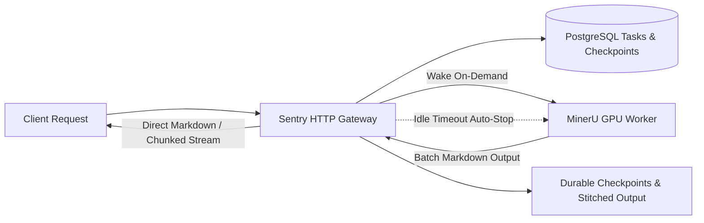

# MinerU-Sentry

English | [简体中文](docs/zh-CN/README-cn.md)

**On-demand GPU gateway for self-hosted MinerU: receives document parsing requests over HTTP, records tasks in PostgreSQL, streams raw Markdown, and stops workers when idle to reclaim RTX 5090 VRAM.**

[Quick Start](#quick-start) · [Parsing & Resumable Streams](#parsing-and-resumable-streams) · [Configuration](#configuration) · [API Reference](#operations-and-api-reference) · [Upstream MinerU](https://github.com/opendatalab/MinerU)



Compose does not allocate GPUs to the Sentry gateway itself; all neural inference is isolated within the GPU worker container. Sentry manages a **pre-created container** lifecycle: waking it when tasks arrive, waiting for health checks to pass, and stopping it after a configurable idle period to keep GPU VRAM at 0 MB during standby.

## Why MinerU-Sentry

- **Direct Markdown in the response body.** Standard endpoints return complete parsed Markdown once finished; streaming endpoints push Markdown chunks as page batches complete. No ZIP archives, no download attachments, and no internal filesystem paths are exposed to callers.
- **Deduplicated and reconnectable tasks.** Files with identical names and contents automatically reuse existing tasks: completed tasks return cached results instantly; interrupted tasks resume from the last durable checkpoint; in-flight tasks attach to the existing execution.
- **Durable page-by-page checkpoints.** PDF parsing defaults to 1 page per batch. Each batch is atomically written to disk and committed to PostgreSQL before advancing. If an interruption or crash occurs, execution safely resumes from the saved checkpoint without repeating expensive GPU inference.
- **Zero-VRAM on-demand GPU management.** Gateway and PostgreSQL run continuously with minimal footprint. When a parsing request arrives, Sentry wakes the GPU worker container; after 15 minutes (configurable) of no active tasks, Sentry stops the container and frees all RTX 5090 VRAM.

> [!NOTE]
> **Scope & Boundaries:** A single gateway process governs one GPU worker container. PDF inputs support granular page-level checkpoint resumption. Other formats are handled as whole documents.

---

## Quick Start

Run the following commands in the repository root on an RTX 5090 Linux host. Requires a compatible NVIDIA driver, Docker Engine, NVIDIA Container Toolkit, Compose 2.17+, and BuildKit. MinerU is built from local source at `${MINERU_SOURCE_DIR}`; models, caches, and parsed outputs reside under `/usr/model/MinerU`.

### 1. Configure Environment (Single Unified File)

All configuration is consolidated in a single environment file (defaults to `core/config/.env.dev`, override via `CONFIG_FILE_PATH`):

```bash
# Copy template and edit configuration
cp core/config/.env.example core/config/.env.dev
$EDITOR core/config/.env.dev
```

- **Unified configuration:** Gateway, GPU Worker, and Docker Compose read from the same `.env` file and `settings.py`.
- **Automatic `mineru.json` generation:** The gateway automatically generates `/usr/model/MinerU/mineru.json` from settings on startup and container wake; manual configuration is never required.
- **Flexible PostgreSQL connection:** Sentry only connects to PostgreSQL and does not bundle database lifecycle. Use an existing database, host service, or external container. To quickly run a dedicated PostgreSQL container via Docker:
  ```bash
  ./docs/deploy/postgres.sh
  ```

### 2. Deploy & Launch

#### Option A: One-Click Initial Setup (Recommended)
Builds images, downloads models, creates the standby worker container, and starts the gateway:
```bash
./docs/deploy/compose.sh init
```

#### Option B: Step-by-Step
```bash
# 1. Build images
./docs/deploy/compose.sh build sentry mineru_worker

# 2. Download models (skip if models already exist locally)
./docs/deploy/compose.sh download

# 3. Create standby worker container and start gateway
./docs/deploy/compose.sh create mineru_worker
./docs/deploy/compose.sh up -d sentry
```

For daily restarts or launches:
```bash
./docs/deploy/compose.sh start
```

Verify service and worker status:
```bash
./docs/deploy/compose.sh --profile worker ps -a
curl --fail-with-body http://localhost:8080/health
```

- **Standby worker behavior:** Sentry wakes the worker container on demand. The worker uses the Compose `worker` profile and remains `exited` during idle periods, ensuring zero VRAM usage.
- Only port `8080` on the gateway is published; gateway and worker communicate via internal Docker networks.

---

## Parsing & Resumable Streams

Uploading a document with the same filename, content hash, and options will automatically connect to or resume the matching task. If options or page ranges conflict with an existing task under the same name, HTTP 409 is returned to protect consistency.

### 1. Return Complete Markdown

```bash
curl --fail-with-body http://localhost:8080/api/v1/parse   -F 'file=@document.pdf'   -F 'backend=hybrid-engine'   -F 'effort=medium'
```

Completed tasks immediately return the full Markdown content. Incomplete tasks continue execution and return the stitched document upon completion. The task ID is provided in the `X-Sentry-Task-ID` response header for diagnostics.

### 2. Chunked Streaming by Batch

```bash
curl -N --fail-with-body http://localhost:8080/api/v1/parse/stream   -F 'file=@document.pdf'
```

Replays the already-saved Markdown prefix, then flushes new batches as they finish parsing. Every reconnect streams from the beginning of the document, so callers should replace partial buffers rather than appending.

Client disconnections do not abort the background parsing task. Failed batches are retried up to 3 times before failing the task.

### 3. Explicit Resume Offset

If pages 0 through 208 have already been committed, resume parsing starting from page index 209 (page 210):

```bash
curl --fail-with-body http://localhost:8080/api/v1/parse   -F 'file=@document.pdf'   -F 's=209'
```

Also accepts `start_page_id=209` as a form field or query parameter. Unfinished tasks automatically resume without specifying `s`. Supplying an offset that skips uncommitted pages returns HTTP 409.

### 4. Fetch or Resume by Filename

Fetch completed results or resume an existing upload using only its filename:

```bash
curl --fail-with-body -X POST http://localhost:8080/api/v1/parse/by-filename/document.pdf
```

---

## Configuration

All configuration items are managed via a single configuration file (default `core/config/.env.dev`, template in [core/config/.env.example](core/config/.env.example)):

| Variable | Default / Description |
| --- | --- |
| `SERVICE_PORT`, `SENTRY_HOST` | `8080`, `0.0.0.0` |
| `POSTGRES_URL` | PostgreSQL hostname or full SQLAlchemy URL; parsing routes disabled if unset |
| `POSTGRES_PORT` | `5432`; requires `POSTGRES_DATABASE`, `POSTGRES_USERNAME`, `POSTGRES_PASSWORD` if URL is a hostname |
| `MINERU_IMAGE_TYPE` | `local` (build from local MinerU source, recommended) or `docker` (pull from custom/private registry) |
| `MINERU_IMAGE_LOCAL` | `mineru-api:5090-source`; image name and tag for local source build mode |
| `MINERU_IMAGE_DOCKER` | Custom remote image address when `MINERU_IMAGE_TYPE=docker` (e.g. private registry; MinerU has no prebuilt image on Docker Hub) |
| `MINERU_WORKER_CONTAINER_NAME` | `mineru_gpu_worker` |
| `MINERU_API_URL` | `http://mineru_worker:8000`; worker endpoint accessible by the gateway |
| `DOCKER_HOST` | Docker socket path; defaults to `unix:///var/run/docker.sock` |
| `IDLE_TIMEOUT_SECONDS` | `900`; idle countdown threshold; checked by monitor loop every 10 seconds |
| `DEFAULT_MINERU_LOCAL_API_STARTUP_TIMEOUT_SECONDS` | `300`; timeout in seconds waiting for worker `/health` readiness |
| `PARSE_BATCH_PAGES` | `1`; pages per checkpoint segment; 1 is recommended for granular resume |
| `DEFAULT_MINERU_TASK_RESULT_TIMEOUT_SECONDS` | `3600`; per-batch polling timeout; retried up to 3 times |
| `SHARED_DATA_DIR` | `/usr/model/MinerU/data`; shared volume between host and containers |
| `MINERU_CONFIG_FILE` | `/usr/model/MinerU/mineru.json`; automatically generated from settings |
| `LOG_PATH`, `LOG_NAME`, `LOG_LEVEL` | Application logging paths; daily rotation with 14 retained backups |

Parsing options are passed as **multipart form fields** per request:

| Field | API Default | Description |
| --- | --- | --- |
| `backend`, `effort`, `parse_method` | `hybrid-engine`, `medium`, `auto` | Parsing engine and strategy |
| `formula_enable`, `table_enable` | `true`, `true` | Formula detection and table extraction |
| `start_page_id`, `end_page_id` | `0`, `99999` | Zero-indexed page range |
| `s` | None (auto-detect) | Explicit resume offset, equivalent to `start_page_id` |

---

## Operations & API Reference

```bash
# Check worker status and idle countdown
curl --fail-with-body http://localhost:8080/api/v1/system/gpu/status

# Wake worker container and await readiness
curl --fail-with-body -X POST http://localhost:8080/api/v1/system/gpu/wake

# Stop worker to free VRAM (rejected if active tasks are running)
curl --fail-with-body -X POST http://localhost:8080/api/v1/system/gpu/sleep

# View gateway logs
sudo ./docs/deploy/compose.sh logs --tail=100 sentry
```

Use `POST /api/v1/system/gpu/sleep?force=true` to force-stop the worker container even when tasks are active (may interrupt running jobs).

| Method & Path | Description |
| --- | --- |
| `POST /api/v1/parse` | Upload, resume, or reuse document; returns complete Markdown |
| `POST /api/v1/parse/stream` | Stream completed prefix and live batch results |
| `POST /api/v1/parse/by-filename/{filename}` | Resume or fetch result by filename; returns complete Markdown |
| `POST /api/v1/parse/resume` | Resume execution by task ID; returns complete Markdown |
| `GET /api/v1/tasks/{task_id}` | Query task details, error status, and segment checkpoints |
| `GET /api/v1/tasks/{task_id}/result` | Return complete Markdown text for a finished task |
| `GET /api/v1/tasks/{task_id}/intermediate` | Return contiguous saved Markdown prefix for an incomplete task |
| `GET /api/v1/tasks/by-filename/{filename}` | Find task records matching exact filename |
| `GET /api/v1/tasks/by-hash/{file_hash}` | Find task records matching file SHA-256 |
| `GET /health` | Basic gateway health check and worker API connectivity |
| `GET /api/v1/system/gpu/status` | Detailed container state and idle timer countdown |
| `POST /api/v1/system/gpu/wake` | Manually wake GPU worker container |
| `POST /api/v1/system/gpu/sleep` | Manually sleep GPU worker container |

---

## Local Development

Requires Python 3.12 with `pip` and `venv`:

```bash
python3 -m venv .venv
. .venv/bin/activate
python -m pip install -r core/requirements.txt
cp -n core/config/.env.example core/config/.env.dev
```

Configure your local database, Docker socket, and storage paths in `core/config/.env.dev`, then launch:

```bash
python core/main.py
```

To run a headless gateway instance without connecting to PostgreSQL (system and GPU APIs remain active):

```bash
POSTGRES_URL='' python core/main.py
```

Inspect API schema or open interactive docs at [http://localhost:8080/docs](http://localhost:8080/docs):

```bash
curl --fail-with-body http://localhost:8080/openapi.json
```

Database schema migrations are automatically executed on startup when PostgreSQL is configured. Archived DDL is available at [core/sql/2026-09-09.sql](core/sql/2026-09-09.sql).

---

## Project & Support

[core/main.py](core/main.py) is the application entry point. [core/](core/) contains APIs, services, entities, and configuration; [docs/deploy/](docs/deploy/) contains container definitions and orchestration scripts.

Tests for checkpoints and result stitching are located at [tests/test_checkpoint_results.py](tests/test_checkpoint_results.py), utilizing an isolated database and real disk files.

Document parsing algorithms and models are provided by [MinerU](https://github.com/opendatalab/MinerU). Please consult upstream repositories for model licensing and third-party terms.
