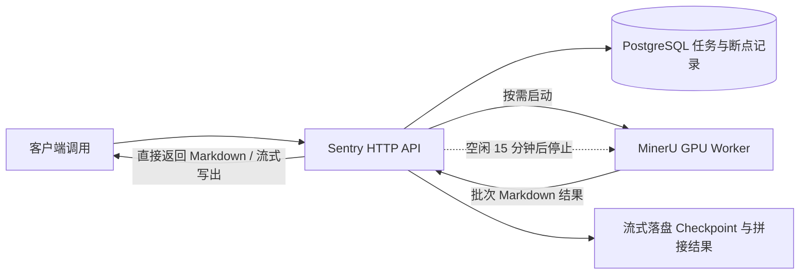

# MinerU-Sentry

[English](../../README.md) | 简体中文

**面向自托管 MinerU 的按需 GPU 网关：通过 HTTP 接收文档解析任务，在 PostgreSQL 中保存任务记录，并在空闲时停止 Worker。**

[快速开始](#快速开始) · [解析文档](#解析文档与断点重连) · [配置](#配置) · [MinerU 上游项目](https://github.com/opendatalab/MinerU)



Compose 未给网关分配 GPU，推理由 Worker 执行。Sentry 启动一个**已经创建的容器**，等待其 API 就绪，并在可配置的空闲时间后停止它。

## 为什么使用 Sentry

- **直接返回解析文本。** 普通接口等待完成后返回完整 Markdown；流式接口按已完成批次返回文本，都不返回 ZIP、下载附件或磁盘路径。
- **同名文件复用同一任务。** 已完成就返回已有结果；未完成就从已落盘的连续前缀继续；正在运行时复用同一执行任务。
- **检查点先落盘再记进度。** PDF 默认每页一个批次，完成后原子写入磁盘，再提交数据库检查点；进程中断后可从已保存结果恢复。
- **按需启停 GPU Worker。** 网关和 PostgreSQL 常驻；解析时启动 Worker，无活动任务且空闲 15 分钟后停止。

**当前范围：** 单个网关进程管理一个 GPU Worker。PDF 支持按页断点续跑；其他格式作为整个文档处理，尚不支持文档内部断点。5090 推理与启停尚需在目标机器验证。

## 快速开始

以下命令在 RTX 5090 Linux 主机的仓库根目录执行。需要兼容的 NVIDIA 驱动、Docker Engine、NVIDIA Container Toolkit、Compose 2.17+ 和 BuildKit。MinerU 从 `/home/hsiong/Project/Python/MinerU` 的本地源码构建；模型、缓存和解析数据统一放在 `/usr/model/MinerU`。

### 1. 配置环境（单一配置文件）

配置已完全合并在单个环境文件中（默认使用 `core/config/.env.dev`，支持通过 `CONFIG_FILE_PATH` 自定义）：

```bash
# 复制并编辑配置
cp core/config/.env.example core/config/.env.dev
$EDITOR core/config/.env.dev
```

- **配置极简统一**：网关、Worker、Docker Compose 均从同一份 `.env` 文件与 `settings.py` 读取。
- **自动生成 `mineru.json`**：系统启动或唤醒 Worker 时，会自动根据 `settings.py` 生成 `/usr/model/MinerU/mineru.json`，无需用户手工编写和维护。
- **PostgreSQL 仅负责连接**：本项目只连接 PostgreSQL 存储任务状态，无论 PostgreSQL 运行在独立机器、宿主机还是容器均可。如需在本地通过 Docker 快速启动一个独立 PostgreSQL，可执行：
  ```bash
  ./docs/deploy/postgres.sh
  ```

### 2. 部署与启动

#### 方式 A：首次一键初始化（推荐）
包含构建镜像、下载模型、创建待机 Worker、启动网关：
```bash
./docs/deploy/compose.sh init
```

#### 方式 B：分步执行
```bash
# 1. 构建镜像
./docs/deploy/compose.sh build sentry mineru_worker

# 2. 下载模型（已有完整兼容模型时可跳过）
./docs/deploy/compose.sh download

# 3. 创建待机 Worker 并启动网关
./docs/deploy/compose.sh create mineru_worker
./docs/deploy/compose.sh up -d sentry
```

日常重启或启动时，仅需执行：
```bash
./docs/deploy/compose.sh start
```

验证服务与 Worker 状态：
```bash
./docs/deploy/compose.sh --profile worker ps -a
curl --fail-with-body http://localhost:8080/health
```

- **待机机制说明**：Sentry 会在有解析任务时按需启动待机 Worker 容器；Worker 属于 `worker` profile，空闲 15 分钟后自动停止进入 `exited` 释放 5090 显存。
- 默认发布网关 `8080` 端口；网关与 Worker 通过内部网络通信。

## 解析文档与断点重连

上传同名、同内容且解析选项一致的文件，即可获取或继续同一个任务。同名但内容、解析选项或结束页不同会返回 HTTP 409，避免混用旧结果；请为不同文档或解析版本使用不同文件名。

### 1. 返回完整结果

```bash
curl --fail-with-body http://localhost:8080/api/v1/parse \
  -F 'file=@document.pdf' \
  -F 'backend=hybrid-engine' \
  -F 'effort=medium'
```

已完成的任务直接返回完整 Markdown 文本；未完成的任务继续执行，完成后再返回。调用方不需要下载文件或自行拼接。任务 ID 仅放在 `X-Sentry-Task-ID` 响应头，供诊断使用。

### 2. 按批次流式返回

```bash
curl -N --fail-with-body http://localhost:8080/api/v1/parse/stream \
  -F 'file=@document.pdf'
```

先返回已有的完整前缀，再随新批次完成返回新增文本。每次重连都从文档开头返回，因此新响应应替换上一次部分结果，不能再次追加到旧响应。普通接口和流式接口都会保存检查点。

断开客户端连接不会主动取消后台任务。Worker 批次失败会有限重试；持续失败时普通接口返回 HTTP 502，已经开始的文本流会异常中止。重新上传同名文件即可重试，已完成批次保留。流式输出是批次粒度，不是逐 token 输出。

### 3. 显式指定断点

如果索引 `0`～`208` 的结果已完整保存，第 210 页对应的续跑索引为 `209`：

```bash
curl --fail-with-body http://localhost:8080/api/v1/parse \
  -F 'file=@document.pdf' \
  -F 's=209'
```

也支持表单 `start_page_id=209` 或查询参数 `?s=209`。通常直接重新上传、不传 `s` 即可自动恢复。显式页码不能跳过尚未保存的页面，否则返回 HTTP 409；若检查点已经超过该页，则从实际检查点继续，不重复拼接。

默认检查点文件为 `0_0.md`、`1_1.md` 等，服务端按顺序合并，输出完整文本。提高 `PARSE_BATCH_PAGES` 可减少 Worker 请求数，但未完成批次需整体重跑，跨批次结构也可能受影响。内部落盘位于 `/usr/model/MinerU/data/tasks/<task_id>/`，客户端无需操作这些文件。

已上传过的文件也可仅凭文件名继续或读取最终结果：

```bash
curl --fail-with-body -X POST http://localhost:8080/api/v1/parse/by-filename/document.pdf
```

## 配置

所有环境变量与服务配置统一位于单一配置文件中（默认为 `core/config/.env.dev`，支持 `CONFIG_FILE_PATH` 覆盖）。模板位于 [core/config/.env.example](../../core/config/.env.example)。网关在启动时读取该文件；启动或唤醒 Worker 时，会自动根据配置生成 `mineru.json`，无需手动编写。

| 配置项 | 默认值或行为 |
| --- | --- |
| `SERVICE_PORT`、`SENTRY_HOST` | `8080`、`0.0.0.0`；`SERVICE_PORT` 优先于兼容变量 `SENTRY_PORT` |
| `POSTGRES_URL` | 数据库主机名或完整 SQLAlchemy URL；未设置时禁用解析接口 |
| `POSTGRES_PORT` | `5432`；使用主机名时还需设置 `POSTGRES_DATABASE`、`POSTGRES_USERNAME` 和 `POSTGRES_PASSWORD` |
| `MINERU_IMAGE_TYPE` | `local`（本地源码编译）或 `docker`（从 Docker 仓库 pull 预构建镜像） |
| `MINERU_WORKER_CONTAINER_NAME` | `mineru_gpu_worker` |
| `MINERU_API_URL` | `http://mineru_worker:8000`；宿主机运行网关需单独提供可访问的 Worker 地址 |
| `DOCKER_HOST` | Docker SDK 连接配置；示例：`unix:///var/run/docker.sock` |
| `IDLE_TIMEOUT_SECONDS` | `900`；监控每 10 秒检查一次 |
| `DEFAULT_MINERU_LOCAL_API_STARTUP_TIMEOUT_SECONDS` | 容器启动等待超时（秒），默认 `300`；兼容旧变量 `WORKER_STARTUP_TIMEOUT_SECONDS` |
| `PARSE_BATCH_PAGES` | `1`；每个 PDF 检查点的页数 |
| `DEFAULT_MINERU_TASK_RESULT_TIMEOUT_SECONDS` | `3600`；每次批次轮询的超时秒数；每批最多尝试 3 次；兼容旧变量 `WORKER_TASK_TIMEOUT_SECONDS` |
| `SHARED_DATA_DIR` | `/usr/model/MinerU/data` |
| `MINERU_CONFIG_FILE` | `/usr/model/MinerU/mineru.json`；系统自动从 settings 生成 |
| `LOG_PATH`、`LOG_NAME`、`LOG_LEVEL` | 应用日志；相对路径基于仓库根目录解析；按天轮转，保留 14 份备份 |

解析选项通过 **multipart 表单字段**传入，不由环境变量设置默认值：

| 字段 | API 默认值 |
| --- | --- |
| `backend`、`effort`、`parse_method` | `hybrid-engine`、`medium`、`auto` |
| `formula_enable`、`table_enable` | `true` |
| `start_page_id`、`end_page_id` | `0`、`99999`（从 0 开始的页码索引） |
| `s` | 可选的恢复页码，等价于 `start_page_id`；默认自动恢复 |

## 运维与 API 参考

```bash
# 查看 Worker 状态和空闲倒计时。
curl --fail-with-body http://localhost:8080/api/v1/system/gpu/status

# 启动 Worker 并等待健康检查通过。
curl --fail-with-body -X POST http://localhost:8080/api/v1/system/gpu/wake

# 停止 Worker；Sentry 有活动任务时会拒绝。
curl --fail-with-body -X POST http://localhost:8080/api/v1/system/gpu/sleep

# 查看服务日志。
sudo ./docs/deploy/compose.sh logs --tail=100 sentry
```

`POST /api/v1/system/gpu/sleep?force=true` 会在有活动任务时仍停止 Worker，可能中断任务。空闲计时只统计通过本网关提交的任务，直接调用 Worker 的请求不在统计范围内。

| 接口 | 用途 |
| --- | --- |
| `POST /api/v1/parse` | 上传、复用或恢复，返回完整 Markdown |
| `POST /api/v1/parse/stream` | 返回已有前缀并流式输出新批次 |
| `POST /api/v1/parse/by-filename/{filename}` | 按文件名复用或恢复，返回完整文本 |
| `POST /api/v1/parse/resume` | 恢复原任务并返回完整文本 |
| `GET /api/v1/tasks/{task_id}` | 查询任务详情、错误和片段 |
| `GET /api/v1/tasks/{task_id}/result` | 返回已完成的 Markdown 文本 |
| `GET /api/v1/tasks/{task_id}/intermediate` | 返回已经保存的连续 Markdown 前缀 |
| `GET /api/v1/tasks/by-filename/{filename}` | 按文件名查询记录 |
| `GET /api/v1/tasks/by-hash/{file_hash}` | 按 SHA-256 查询记录 |
| `GET /health`、`GET /api/v1/system/gpu/status` | 查询 Worker 状态和空闲倒计时 |
| `POST /api/v1/system/gpu/wake`、`POST /api/v1/system/gpu/sleep` | 手动控制 Worker 生命周期 |

任务、片段和检查点持久化，执行线程与活动任务计数保存在内存中。请运行单个网关进程；重启后通过重新上传或按文件名请求恢复任务，不会在启动时自动重放全部任务。仍存在的 Worker 任务会重连，明确失败或已丢失的批次会重新提交。

上传按块写入磁盘；普通完整响应会在网关内存中组装，大文档可使用流式接口。持久化依赖数据库和共享目录同时保留；如果已完成片段的文件丢失，接口会报错，不会悄悄返回缺页结果。停止 Worker 会结束其 GPU 进程，Sentry 不测量实际释放的显存。

## 本地开发

使用 Python 3.12，并确保 `pip` 和 `venv` 可用。Debian/Ubuntu 可能需要安装 `python3-venv` 软件包。

```bash
python3 -m venv .venv
. .venv/bin/activate
python -m pip install -r requirements.txt
cp -n core/config/.env.example core/config/.env.dev
```

按宿主机环境修改数据库、Docker 连接、共享目录和 Worker URL，然后运行：

```bash
python main.py
```

若只需在不连接 PostgreSQL 的情况下查看系统 API，可使用以下方式启动网关：

```bash
POSTGRES_URL='' python main.py
```

在另一个终端获取接口定义，或打开 [Swagger UI](http://localhost:8080/docs)：

```bash
curl --fail-with-body http://localhost:8080/openapi.json
```

此模式不注册解析接口；`/health` 和 GPU 操作仍需要访问 Docker。配置 PostgreSQL 后，启动时会尝试建表；归档 SQL 位于 [core/sql/2026-09-09.sql](../../core/sql/2026-09-09.sql)。

## 项目与支持

[main.py](../../core/main.py) 是应用入口。[core/](../../core/) 包含 API、服务、持久化和配置；[docs/deploy/](../deploy/) 包含容器构建文件与 Compose 编排。

报告问题时，请提供出错接口、任务状态或错误、实际安装的 MinerU 版本、相关日志及已移除凭据的部署信息。检查点与结果接口的测试位于 [tests/test_checkpoint_results.py](../../tests/test_checkpoint_results.py)，使用独立 PostgreSQL 数据库和真实磁盘文件；Worker 对接仍需在运行中的 MinerU 服务上验证。

文档解析由 [MinerU](https://github.com/opendatalab/MinerU) 提供。本仓库目前没有许可证文件；本项目的授权条款请咨询维护者，上游项目的许可证请查阅其各自仓库。
