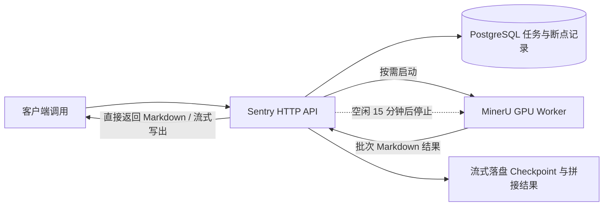

# MinerU-Sentry

[English](../../README.md) | 简体中文

**面向自托管 MinerU 的按需 GPU 网关：通过 HTTP 接收文档解析任务，在 PostgreSQL 中保存任务记录，并在空闲时停止 Worker。**

[快速开始](#快速开始) · [解析文档](#解析文档) · [配置](#配置) · [MinerU 上游项目](https://github.com/opendatalab/MinerU)



Compose 未给网关分配 GPU，推理由 Worker 执行。Sentry 启动一个**已经创建的容器**，等待其 API 就绪，并在可配置的空闲时间后停止它。

## 为什么使用 Sentry

- **直接输出 Markdown 结果，无需 ZIP 或下载。** 解析完成后直接在 HTTP 响应体中返回完整的 Markdown 文本；不输出 ZIP 压缩包或繁琐的下载链接。
- **单独的流式落盘与流式写出接口。** 提供专属 `/api/v1/parse/stream` 接口；每个批次完成时即时写入磁盘 Checkpoint（流式落盘），同时即时写出到客户端（流式写出）。前面已完成批次的中间数据安全保留在磁盘上。
- **无缝断点重连（自动续跑与拼接）。** 无论通过标准接口还是流式接口，上传同名文件时：
  - **已完成的文件**：直接秒级输出完整结果，无需重新解析。
  - **未完成/异常中断的文件**：自动检测最后已落盘 Checkpoint，从断点处无缝继续解析直至完成，服务端自动将前面完成的批次（如 `0_208.md`）与续跑出的剩余批次（如 `209_end.md`）拼接成完整文档返回，无需任何外围脚本手动拼接。
- **原生支持 `-s` 续跑参数。** 支持直接传入 `-F s=209` 或 `?s=209`（从 0 索引的页码）；指定从断点页续跑时，服务端同样自动与已完成的前置批次缝合输出完整结果。
- **GPU 智能生命周期管理。** 空闲达到设定阈值自动停止 GPU Worker 释放显存，按需自启。

**当前范围：** 单个网关进程管理一个 GPU Worker。提供的 Worker 构建方案面向 RTX 5090；仓库尚未包含硬件基准测试或 GPU 端到端测试套件。

## 快速开始

以下命令均在仓库根目录执行。完整解析需要 Docker Engine 与 Compose、具有兼容驱动和 NVIDIA Container Toolkit 的 Linux NVIDIA GPU 主机，以及已下载的 MinerU 本地模型。网关镜像使用 Python 3.12，Compose 提供 PostgreSQL 16。

### 1. 准备本地模型

```bash
sudo mkdir -p /usr/model/MinerU/pipeline /usr/model/MinerU/vlm /usr/model/MinerU/data
sudo cp -n core/config/mineru.template.json /usr/model/MinerU/mineru.json
```

按照 MinerU 的[本地模型说明](https://opendatalab.github.io/MinerU/usage/model_source/)下载与安装版本匹配的模型。将 pipeline 和 VLM 模型文件放入上述目录，或修改 `/usr/model/MinerU/mineru.json` 中的 `models-dir`，使其指向 **Worker 容器内**的实际位置。只有空目录和 JSON 模板还不能解析文档。

两个容器都将 `/usr/model/MinerU` 挂载到相同路径。确保容器可读取模型和配置，并可写入 `data` 目录。

### 2. 构建并创建 Worker，再启动网关

[Compose 文件](../../deploy/docker-compose.yml)包含示例数据库凭据、对外映射的 `8080`、`8000`、`5432` 端口，以及供 Sentry 使用的 Docker socket 挂载。请在可信主机上使用，并在对外开放前配置凭据和网络访问。API 尚无内置身份认证，GPU 控制接口也不例外。

```bash
docker compose -f deploy/docker-compose.yml build sentry mineru_worker
docker compose -f deploy/docker-compose.yml create mineru_worker
docker compose -f deploy/docker-compose.yml up -d sentry postgres
curl --fail-with-body http://localhost:8080/health
```

**不要跳过 `create mineru_worker`。** Sentry 可以启动、停止指定名称的容器，但不能创建它。Worker 在收到解析请求或手动唤醒前保持停止；首次启动前通常为 `created`，停止后为 `exited`。

打开 [Swagger UI](http://localhost:8080/docs)查看接口定义。`/health` 返回 Docker Worker 状态，不检查数据库是否就绪。Worker 停止时 `mineru_api_healthy=false` 属于正常情况；`is_gpu_active` 表示容器运行状态，并非实测 GPU 利用率。

[Worker Dockerfile](../../deploy/worker.Dockerfile)使用 `vllm/vllm-openai:v0.21.0` 的镜像源，并安装 `mineru[core]>=3.4.0`。依赖未完全锁定，需要在目标主机验证实际安装版本的 MinerU API 和 GPU 运行环境。默认等待启动最多 300 秒，不承诺固定冷启动耗时。

## 解析文档与断点重连

准备本地文档（如 `document.pdf`）。支持的文件格式取决于实际安装的 MinerU Worker。

### 1. 标准解析（直接获取 Markdown 结果）

```bash
curl --fail-with-body http://localhost:8080/api/v1/parse \
  -F 'file=@document.pdf'
```

- **完成的文档**：直接返回最终完整的 Markdown 结果（无 ZIP，无文件下载附件）。
- **未完成或中断的文档**：自动从断点继续解析直至完成，并返回完整拼接后的结果。

### 2. 流式解析与流式落盘（单独接口）

针对大文档，使用专用的流式解析接口。Sentry 边解析边落盘 Checkpoint，同时边向客户端 Streaming 写出结果：

```bash
curl -N --fail-with-body http://localhost:8080/api/v1/parse/stream \
  -F 'file=@document.pdf'
```

- 批次完成时，其中间 Markdown 自动持久化到磁盘 `checkpoints/{start}_{end}.md`（流式落盘）。
- 客户端实时接收已解析的内容流（流式结果写出）。
- 若中途因异常断开，已完成批次完整保存在磁盘上。

### 3. 断点重连与结合 `-s` 续跑

假设一个大文件在执行到第 210 页时发生异常中断：
- 前 0~208 页已落盘为 Checkpoint（如 `0_208.md`）。
- **方式一（自动断点重连）**：再次提交同名文件即可，系统自动识别已落盘进度，无缝从第 209 页续跑并拼接输出完整结果：
  ```bash
  curl --fail-with-body http://localhost:8080/api/v1/parse \
    -F 'file=@document.pdf'
  ```
- **方式二（指定 `-s` 续跑）**：显式指定从第 209 页开始续跑：
  ```bash
  curl --fail-with-body http://localhost:8080/api/v1/parse \
    -F 'file=@document.pdf' \
    -F 's=209'
  ```
  服务端自动将第一次跑出的 `0_208.md` 和续跑出的 `209_end.md` 完成内部字符串追加拼接，直接返回完整 Markdown 文本。无需任何外围业务脚本处理拼接。

## 配置

本地运行时，将 [env.example](../../core/config/env.example)复制为 `core/config/.env.dev`。进程环境变量优先；`CONFIG_FILE_PATH=.env.prod` 对应 `core/config/.env.prod`，也支持绝对路径。Compose 使用自身传入的环境变量，不会自动加载此文件。

| 配置项 | 默认值或行为 |
| --- | --- |
| `SERVICE_PORT`、`SENTRY_HOST` | `8080`、`0.0.0.0`；`SERVICE_PORT` 优先于兼容变量 `SENTRY_PORT` |
| `POSTGRES_URL` | 数据库主机名或完整 SQLAlchemy URL；未设置时禁用解析接口 |
| `POSTGRES_PORT` | `5432`；使用主机名时还需设置 `POSTGRES_DATABASE`、`POSTGRES_USERNAME` 和 `POSTGRES_PASSWORD` |
| `MINERU_WORKER_CONTAINER_NAME` | `mineru_gpu_worker` |
| `MINERU_API_URL` | `http://mineru_worker:8000`；网关在宿主机运行、通过映射端口访问 Worker 时使用 `http://127.0.0.1:8000` |
| `DOCKER_HOST` | Docker SDK 连接配置；示例：`unix:///var/run/docker.sock` |
| `IDLE_TIMEOUT_SECONDS` | `900`；监控每 10 秒检查一次 |
| `WORKER_STARTUP_TIMEOUT_SECONDS` | `300` |
| `SHARED_DATA_DIR` | `/usr/model/MinerU/data` |
| `LOG_PATH`、`LOG_NAME`、`LOG_LEVEL` | 应用日志；相对路径基于仓库根目录解析；按天轮转，保留 14 份备份 |

解析选项通过 **multipart 表单字段**传入，不由环境变量设置默认值：

| 字段 | API 默认值 |
| --- | --- |
| `backend`、`effort`、`parse_method` | `hybrid-engine`、`medium`、`auto` |
| `formula_enable`、`table_enable` | `true` |
| `start_page_id`、`end_page_id` | `0`、`99999`（从 0 开始的页码索引） |
| `auto_resume` | `true` |

当前网关没有使用 `env.example` 中的 `DEFAULT_*` 和 `HOST_MINERU_DIR`。`MINERU_CONFIG_FILE` 不负责配置 Worker；Worker 读取的是 Compose 设置的 `MINERU_TOOLS_CONFIG_JSON`。Compose 还设置了 `MINERU_MODEL_SOURCE=local` 和 `MINERU_PROCESSING_WINDOW_SIZE=64`，后者属于 Worker 配置，不代表网关保证显存不会溢出。

## 运维与 API 参考

```bash
# 查看 Worker 状态和空闲倒计时。
curl --fail-with-body http://localhost:8080/api/v1/system/gpu/status

# 启动 Worker 并等待健康检查通过。
curl --fail-with-body -X POST http://localhost:8080/api/v1/system/gpu/wake

# 停止 Worker；Sentry 有活动任务时会拒绝。
curl --fail-with-body -X POST http://localhost:8080/api/v1/system/gpu/sleep

# 查看服务日志。
docker compose -f deploy/docker-compose.yml logs --tail=100 sentry mineru_worker
```

`POST /api/v1/system/gpu/sleep?force=true` 会在有活动任务时仍停止 Worker，可能中断任务。空闲计时只统计通过本网关提交的任务，直接调用 Worker 的请求不在统计范围内。

| 接口 | 用途 |
| --- | --- |
| `POST /api/v1/parse` | 上传并提交文档 |
| `POST /api/v1/parse/resume` | 创建恢复任务 |
| `GET /api/v1/tasks/{task_id}` | 查询任务详情、错误和片段 |
| `GET /api/v1/tasks/{task_id}/result` | 下载已完成的 Markdown |
| `GET /api/v1/tasks/{task_id}/intermediate` | 列出已有文件并预览 Markdown |
| `GET /api/v1/tasks/by-filename/{filename}` | 按文件名查询记录 |
| `GET /api/v1/tasks/by-hash/{file_hash}` | 按 SHA-256 查询记录 |
| `GET /health`、`GET /api/v1/system/gpu/status` | 查询 Worker 状态和空闲倒计时 |
| `POST /api/v1/system/gpu/wake`、`POST /api/v1/system/gpu/sleep` | 手动控制 Worker 生命周期 |

任务记录持久化，但执行线程和活动任务计数保存在内存中。请运行单个网关进程：当前没有持久化任务队列、重启后自动恢复或跨进程调度协调。Worker 状态轮询会持续重试，没有总超时，因此 Worker 不可达时任务可能一直处于活动状态，需要人工处理。

上传文件会读入网关内存。请在入口层设置适当的上传限制，并在应用外管理存储保留策略。停止 Worker 会结束其 GPU 进程；Sentry 不测量已释放显存，也不统计其他应用占用的显存。

## 本地开发

使用 Python 3.12，并确保 `pip` 和 `venv` 可用。Debian/Ubuntu 可能需要安装 `python3-venv` 软件包。

```bash
python3 -m venv .venv
. .venv/bin/activate
python -m pip install -r requirements.txt
cp -n core/config/env.example core/config/.env.dev
```

按宿主机环境修改数据库、Docker 连接、共享目录和 Worker URL，然后运行：

```bash
python main.py
```

若只需在不连接 PostgreSQL 的情况下查看系统 API，可使用以下方式启动网关：

```bash
POSTGRES_URL='' python main.py
```

在另一个终端获取接口定义，或打开 [Swagger UI](http://localhost:8080/docs)：

```bash
curl --fail-with-body http://localhost:8080/openapi.json
```

此模式不注册解析接口；`/health` 和 GPU 操作仍需要访问 Docker。配置 PostgreSQL 后，启动时会尝试建表；归档 SQL 位于 [core/sql/2026-09-09.sql](../../core/sql/2026-09-09.sql)。

## 项目与支持

[main.py](../../main.py) 是应用入口。[core/](../../core/) 包含 API、服务、持久化和配置；[deploy/](../../deploy/) 包含容器构建文件与 Compose 编排。

报告问题时，请提供出错接口、任务状态或错误、实际安装的 MinerU 版本、相关日志及已移除凭据的部署信息。仓库尚无已提交的自动化测试套件；修改 Worker 对接时需要在运行中的 MinerU 服务上验证。

文档解析由 [MinerU](https://github.com/opendatalab/MinerU) 提供。本仓库目前没有许可证文件；本项目的授权条款请咨询维护者，上游项目的许可证请查阅其各自仓库。
